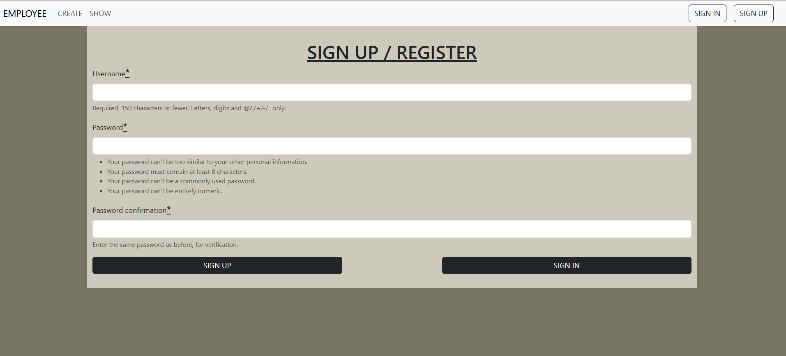
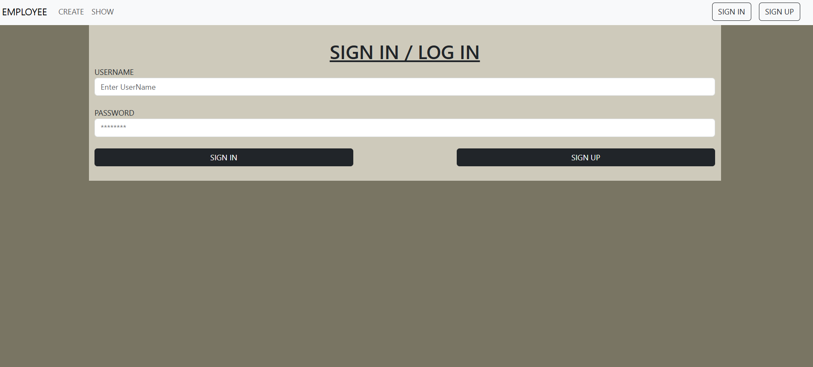
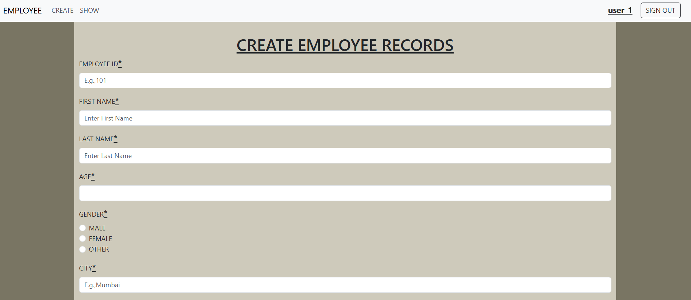
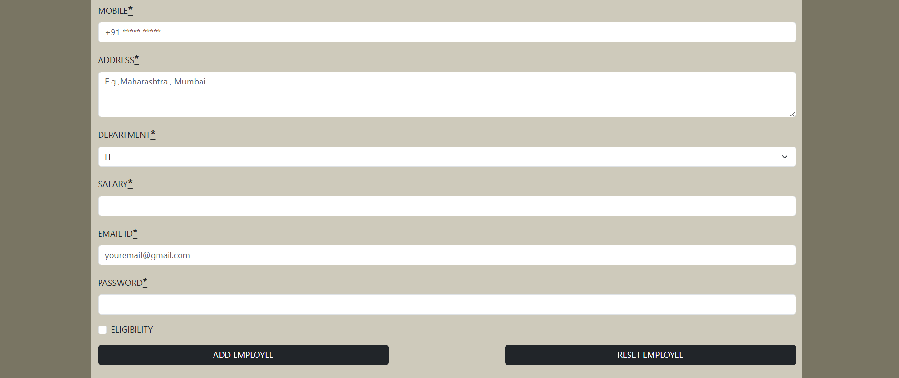
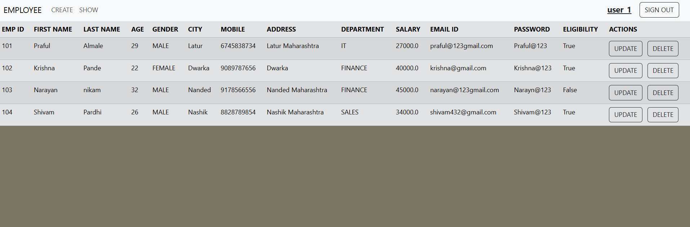
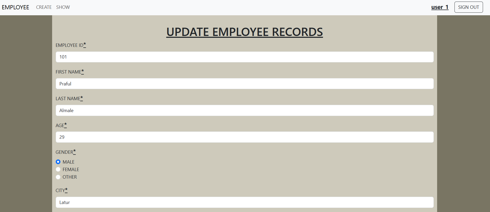
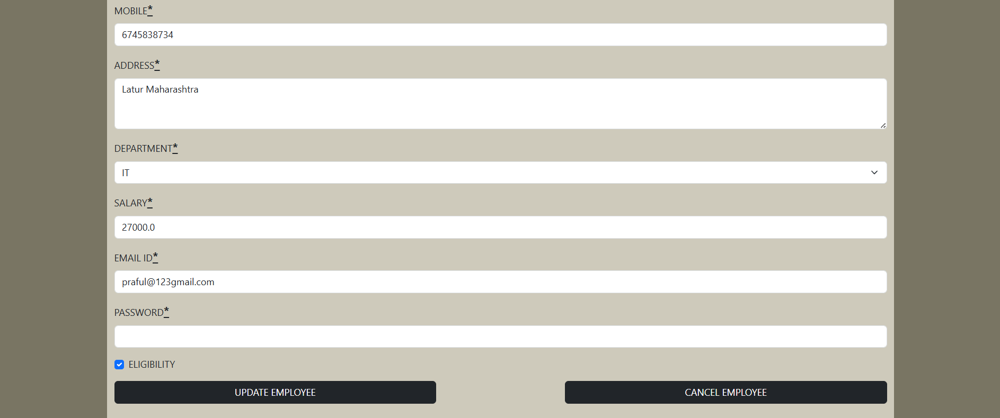
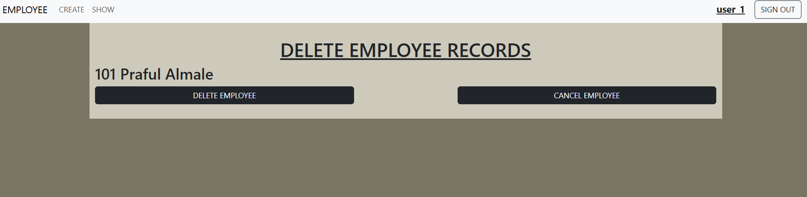

# Django Employee CRUD

A simple Django project to manage employees (create, read, update, delete) with Django's built-in authentication (register/login/logout).

## Features
- User registration, login, and logout
- Add, view, update, and delete employees
- Clean UI for managing employee data
- Multiple screenshots to showcase functionality

## Screenshots

### Register / Sign Up  


---

### Sign In  


---

### Add Employee Page
  


---

### Employee List  


---

### Update Employee Page
  


---

### Delete Employee Page


---

## Quick Start

1. Clone the repo:
```bash
git clone https://github.com/YOUR_USERNAME/django-employee-crud.git
cd django-employee-crud
```

2.Create & activate a virtual environment:
```
python -m venv venv
venv\scripts\activate
```

3.Install dependencies:
```
pip install -r requirements.txt
```

4.Apply migrations
```
python manage.py migrate
```

5.Run the development server:
```
python manage.py runserver
```

